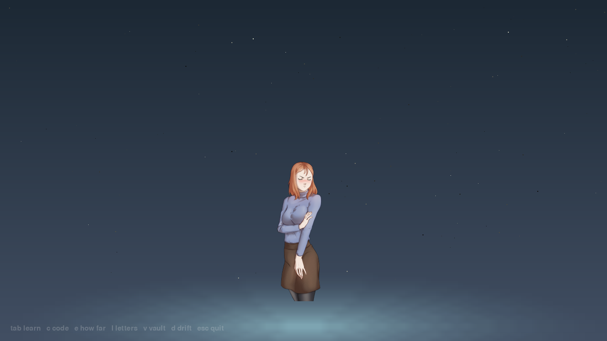
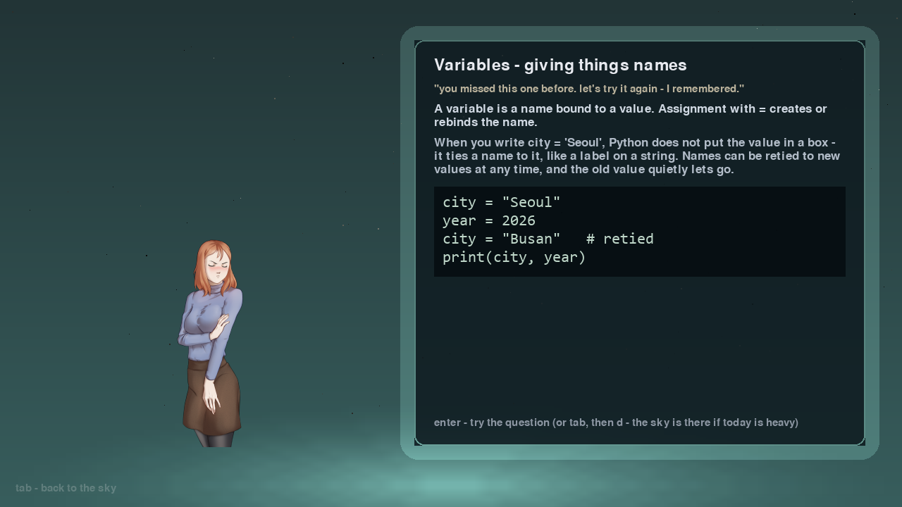
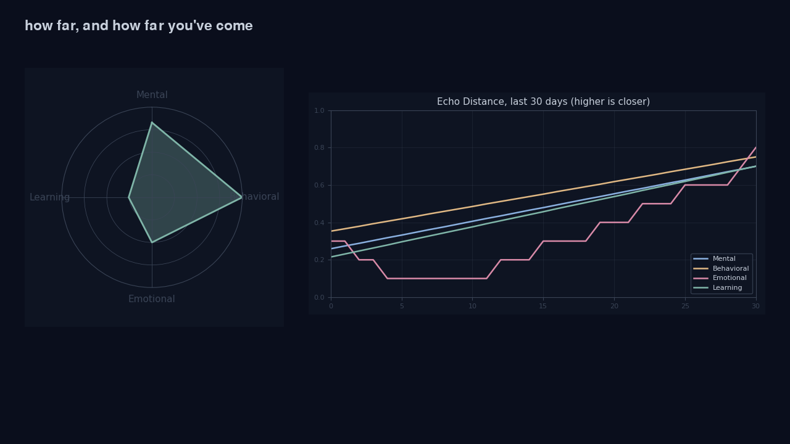

# EchoSelf

> *"The version of you that made it - is waiting to tell you how."*


&nbsp; License: MIT (engine) + CC BY 4.0 (content)

This is my final project for Introduction to Open Source Software. On the surface it is a
program that teaches you to code. Underneath it is something I have wanted to exist for a
long time: a companion that learns who you are without asking, and slowly becomes who you
need it to be.

Built by **Prodipta Acharjee**, Sejong University.

---

## Why I built it

There is a gap between who people want to be and who they actually are, and almost nothing
addresses that gap without adding pressure. Productivity apps feel mechanical. Journaling
needs energy you do not have on the bad days. AI chatbots give advice and then forget you
existed. Programming tutorials are built for everyone, which means they are built for no one.

So I am building a character that teaches you, watches how you learn, and decides on its
own whether you need a challenge or empathy today, a push or silence. You never tell it how
you feel. It reads how you answer, how long you pause, when you show up and when you stop
showing up. The character starts as a preset personality and drifts, session by session,
toward whatever actually works for you. It never announces this. You just notice, after a
few weeks, that it knows you.

The rule behind every feature: **presence over pressure**. Nothing in here shames you,
nothing guilts you, nothing pushes harder than you can take that day.

---

## The three worlds

Everything happens in one of three places, with one ML brain underneath all of them:

- **The Ambient World** - a living sky in Pygame. Your character's color bleeds into the
  environment, stars drift with your Echo Distance. Drift Mode lives here: a soft place to
  just exist, no interaction required, one keypress away from anywhere.
- **The Learning World** - where the character teaches. A glowing panel opens beside them
  with the lesson, code examples, challenges. The world's color shifts with your detected
  psychological state.
- **The Inner World** - invisible, always running. A behavioral model that builds a
  fingerprint of you from interaction patterns (never from your private writing, see
  [SECURITY.md](SECURITY.md)) and tells the character what you need.

## What it does

- **A character, drawn two ways.** By default she's painted art - a layered, openly-licensed
  pack the engine composites and animates. With no art pack, she's drawn entirely by code as a
  fallback, every feature a parameter. Either way she breathes, blinks, and reacts.
- **Five starting personalities** - the Strict Mentor, the Gentle Guide, the Playful Rival,
  the Philosophical Elder, the Quiet Empath. Or build your own. The painted default pack is
  female for now; a painted male pack (CC BY 4.0, to match) is on the roadmap.
- **Personality drift.** Every session nudges the personality toward what works for you.
  After thirty sessions it has genuinely changed. It never says so.
- **CodePath.** Learn Python deeply through lessons taught in the character's voice, with C,
  C++ and Java as quiz-based intro tracks. Quizzes happen in-world; in Python, real coding
  challenges open as a starter file in *your own editor*, and the character runs the tests and
  reacts when they pass. A mastery dashboard shows how far you have come, with no guilt for a break.
- **Four-axis Echo Distance.** The gap between your current self and your ideal self,
  tracked across Mental, Behavioral, Emotional and Learning, drawn as a radar chart with a
  30-day timeline.
- **Dark Days Protocol.** A low-mood streak stops everything. No lessons, no prompts. The
  character stays.
- **Mirror Report.** A weekly reflection, written in your ideal self's voice.
- **The Vault.** An encrypted private writing space. The system holds it, it never reads it.
- **Echo Exchange.** Anonymous community sentences - something your ideal self told you
  that helped - contributed by pull request.

## Look

The character in the living sky, a lesson in the Learning World, and the four-axis Echo
Distance over a month:





## Status

Feature-complete and then some. The course core: the character (painted or code-drawn), the ML
brain and the silent personality drift, four language tracks, the three worlds, the four-axis Echo
Distance, the Dark Days Protocol, the Mirror Report, the Vault, Letters, Echo Exchange, the
procedural soundscape, and demo + time-lapse modes. On top of that, the companion it was always
meant to be: she reads how you feel, holds a real conversation, remembers you between days, reaches
out once a day, offers gentle coping tools, switches between friend and teacher, and the brain
learns you from how you talk. 244 tests, run on every push. The one optional layer (the mirror-self
voice, bring your own key) is off by default; everything else runs offline.

## Getting started

You need Python 3.10 or newer.

```
git clone https://github.com/serendurious-dev/echoself.git
cd echoself
pip install -r requirements.txt
python main.py
```

## Usage

```
python main.py                 normal session
python main.py --demo          a lived-in profile, ~35 days of history already there
python main.py --timelapse     each session counts as a full day
python main.py --doctor        prove the OS layer works (lock, atomic writes, daemon), then exit
python main.py --daemon start  the companion daemon between sessions: start / stop / status
```

EchoSelf is local-first with no server, so it does its own systems work: a file lock keeps the
app and a background companion daemon from corrupting your data, writes are atomic (a crash
leaves the old file or the new one, never half), and a launch audit cleans up after an unclean
exit. `--doctor` proves all of it in one command.

The `--demo` flag exists because the deepest features here - the drift, the Mirror Report,
Dark Days - only emerge over weeks of real use. Demo mode lets you feel the lived-in
version immediately instead of taking my word for it.

## Project structure

```
main.py             entry point
core/               echo builder, sessions, narrative, demo mode
character/          the renderer, expressions, personality drift
learning/           codepath, quizzes, the challenge runner
ml/                 the brain: behavioral model, psychology layer, archetypes
visual/             the three worlds, charts
audio/              soundscape, synthesized not sampled
characters/         personality packs (JSON, CC BY 4.0)
lessons/            lesson packs per track (JSON, CC BY 4.0)
arcs/               narrative arc packs (JSON, CC BY 4.0)
exchange/           echo exchange sentences (CC BY 4.0)
data/               your local data. never committed, never leaves your machine
```

## Privacy

Local-first by default. No server, no account, no telemetry. Everything you do stays in
`data/` on your machine, and `data/` is gitignored so it cannot even be committed by
accident. With the defaults, EchoSelf makes no network calls at all. The full promise is in
[SECURITY.md](SECURITY.md).

There is one **optional, off-by-default** layer: if you install `requirements-llm.txt` and add
your *own* Anthropic API key, the character can answer in a richer "mirror-self" voice powered by
a model. That layer - and only that layer - sends the conversation to the API over the network;
leave it off and nothing ever leaves your machine. Crisis messages never reach it.

Because EchoSelf reads how you feel and tries to support you, it also carries a plain
[ETHICS.md](ETHICS.md): it is a companion, not a clinician; crisis always comes first and
points to real human help; support is offered, never forced; and the coping ideas it draws
on are sourced. That document is part of the project on purpose, not an afterthought.

## Contributing

Code and creative content are both welcome - personality packs, lesson packs, narrative
arcs, exchange sentences. [CONTRIBUTING.md](CONTRIBUTING.md) has the formats and the
workflow, [CODE_OF_CONDUCT.md](CODE_OF_CONDUCT.md) has the ground rules.

## Two licenses, on purpose

- **MIT** for the engine - everything in `core/`, `character/`, `learning/`, `ml/`,
  `visual/`, `audio/` and `main.py`. See [LICENSE](LICENSE).
- **CC BY 4.0** for creative content - `characters/`, `lessons/`, `arcs/`, `exchange/`.
  See [LICENSE-CONTENT](LICENSE-CONTENT).

Code and creative writing have different legal needs. MIT keeps the engine maximally
forkable, CC BY 4.0 makes sure the people who write characters and lessons are always
credited. Dependencies and their licenses are listed in
[THIRD_PARTY_NOTICES.md](THIRD_PARTY_NOTICES.md). How a free project like this could still
sustain itself - an Open Core model - is laid out in [BUSINESS.md](BUSINESS.md).

The default character art is the Codel sprite by **LisadiKaprio** (CC BY 4.0), from
[OpenGameArt](https://opengameart.org/content/codel-visual-novel-sprite); attribution and the
changes I made are in [characters/art/codel/LICENSE.txt](characters/art/codel/LICENSE.txt). Swap
in your own art any time - see [characters/art/README.md](characters/art/README.md).

## Roadmap

- **v1.0** - character system (custom + the five presets), the ML brain and psychology
  layer, personality drift, the full Python track, the three worlds, four-axis Echo
  Distance, Dark Days, Mirror Report, the Vault, Letters, Echo Exchange, the soundscape,
  demo and time-lapse modes.
- **v1.5** - C and Java tracks, deeper analysis of written responses, longer pattern memory.
- **v2.0** - all four tracks, a community lesson pack ecosystem, anonymous peer challenges,
  study pods.

---

This project came from a real feeling, the exhaustion of surviving instead of living, and
the wish for something that knows you without needing you to explain yourself. EchoSelf
does not optimize your productivity and it does not gamify your discipline. It builds a
character that learns you, and slowly, without announcing it, the character becomes who
you needed all along.

That is what open source is too - something built by people for people, freely given,
honestly maintained, always there.
